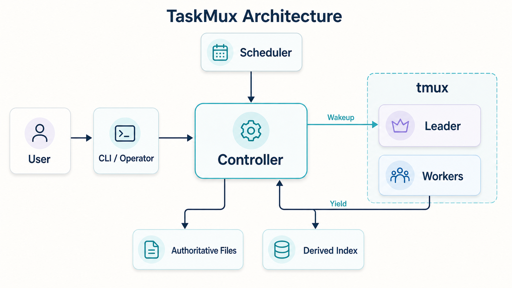
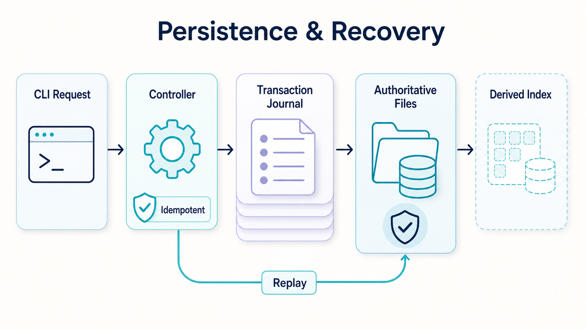
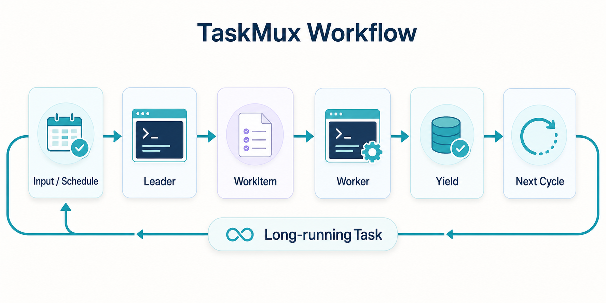

# TaskMux Architecture

This document describes the current architectural contract of TaskMux. It is a maintained system reference, not a roadmap, requirements log, or implementation history.

## Design principles

1. **Local first.** Task data and Agent sessions stay on one machine unless the user explicitly moves them.
2. **One mutation boundary.** The Controller serializes ordinary state changes and owns recovery.
3. **Files are authoritative.** JSON, JSONL, and Markdown contain durable business state; SQLite is derived.
4. **Native Agents remain native.** TaskMux coordinates existing Agent CLIs instead of replacing their session models.
5. **Tasks are long-lived.** Cycles, WorkItems, and AgentRuns provide finite execution boundaries.
6. **Meaning and runtime stay separate.** Task direction is not inferred from tmux windows or process state alone.

## System context



TaskMux has no required remote control plane, database server, or message broker. The CLI remains the public interface; the Controller is local infrastructure.

## Components

| Component | Responsibility |
| --- | --- |
| **CLI** | Parse commands, optionally resolve omitted references to locally enumerable TaskMux objects in an interactive terminal, render human or JSON output, and route ordinary operations to the Controller. |
| **Controller** | Authenticate local RPC, serialize mutations, deduplicate request IDs, run recovery, and refresh derived state. |
| **Domain services** | Apply Task, role, Cycle, WorkItem, schedule, decision, milestone, and session rules. |
| **Scheduler** | Detect scheduled reviews, recurring work, inactivity, expired AgentRuns, and exited tmux windows. |
| **File repository** | Read and write the authoritative local model. |
| **Derived index** | Provide rebuildable Task, role, and WorkItem lookups in SQLite. |
| **Agent executors** | Translate common start, recover, send, interrupt, stop, and status operations into Agent-specific commands. |
| **tmux runtime** | Keep independent native Agent sessions alive and attachable. |
| **System Skills** | Guide Operator, Leader, and Worker behavior without becoming a permission system. |

## Domain model

| Entity | Relationship |
| --- | --- |
| **Task** | Owns Cycles, WorkItems, TaskRoles, Topics, Decisions, and Milestones. |
| **Cycle** | Groups one bounded period of advancement and may contain WorkItems. |
| **WorkItem** | May span one or more AgentRuns until it reaches a terminal outcome. |
| **TaskRole** | Owns the execution contract and AgentRuns for one responsibility. |
| **AgentRun** | Records one asynchronous dispatch round and its durable result. |

### Task lifecycle

A Task is a durable mission, not a ticket. It has one terminal-like marker: `archived`. Continued progress is represented by Cycles and WorkItems rather than `open`, `active`, and `done` Task states.

### Role model

- **Operator** is a persistent global administrative session. It manages TaskMux through the CLI but does not perform Task work.
- **Leader** is the single fixed Task-local session responsible for direction, decomposition, synthesis, and archival.
- **Independent roles** have their own Agent session, tmux window, AgentRuns, and optional Git worktree.
- **Child roles** contain descriptive constraints for a parent role. They have no TaskMux-managed session, tmux window, worktree, or AgentRun.

Global role templates use copy semantics. Once a role is bound into a Task, later template changes do not mutate the TaskRole.

## Command and transaction flow



Mutating request IDs are idempotent. A committed result is returned without reapplying the command. If a process stops after a transaction is staged, Controller startup completes the staged operation before serving requests.

The command catalog is the authoritative public CLI vocabulary. It assigns every command to one semantic section and defines stable order within each section; help and Bash, Zsh, and Fish completion consume that structure directly. Public operations have one canonical spelling: scoped help uses `taskmux help [command path]`, and version output uses `taskmux version`. Completion suppresses unrelated filesystem fallback at catalog-owned positions while retaining catalog-declared enum, file/path, and executable ownership.

Before the existing execution boundary, the CLI may guide a terminal user to select an omitted reference that TaskMux can enumerate from local authoritative state. Explicit arguments are never replaced, and scripts, redirected IO, and JSON invocations remain deterministic and non-interactive. The selected value is still validated by the ordinary command path.

Setup is an explicit lifecycle operation. Ordinary CLI, dashboard, Task shell, import, prune, backup, attach-state, and Scheduler mutations share the Controller boundary.

## Dispatch and wakeup flow



Dispatch returns after the native session accepts the work; execution remains asynchronous. Yield ends the AgentRun, updates any linked WorkItem, and queues one coalesced Leader wakeup.

The Leader session is never silently replaced. Permanent recovery failure pauses Leader wakeups and creates a durable Operator notification until a user explicitly records a replacement session.

## Persistence

The default root is `~/.taskmux`; `TASKMUX_HOME` overrides it.

```text
TASKMUX_HOME/
  config.json
  schema.json
  agents/
  roles/
  tasks/<task-id>/
    info.json
    task.json
    brief.md
    timeline.md
    topic-summaries.md
    comments.jsonl
    events.jsonl
    roles/
    cycles/
    work-items/
    milestones/
    decisions/
  runtime/
    controller.json
    index.sqlite
    domain-transactions/
    recovery-journal/
    role-sessions/
    active-runs/
    pending-wakeups/
    operator-notifications/
    logs/
```

`schema.json` must match the current storage contract. TaskMux rejects other schema versions.

### Authoritative and derived state

- JSON stores structured snapshots and runtime records.
- JSONL stores append-only comments, events, and diagnostics.
- Markdown stores curated semantic context.
- SQLite stores only derived lookup data and may be deleted and rebuilt.

TaskMux does not run a filesystem watcher or a polling loop for direct file edits. Derived state is refreshed at explicit boundaries only:

1. Controller startup;
2. successful Controller command transactions;
3. Scheduler scans.

The supported mutation path is the CLI. Direct file edits are not automatically detected and should not be used when immediate, predictable application is required.

## Agent and tmux boundaries

One Task maps to one tmux session. Each independent TaskRole maps to one window and native Agent session. When the Leader workspace is a Git repository, independent roles require an explicit TaskMux worktree before dispatch.

Agent-specific command construction stays behind a common executor contract. The Scheduler does not build Codex or Claude commands, the context compiler does not control tmux, and tmux does not interpret Task semantics.

## Scheduling and recovery

The Scheduler handles recurring intervals, one-off review times, inactivity, AgentRun TTLs, and exited role windows. Trigger reasons are persisted and coalesced before the Leader is recovered.

Recovery guarantees focus on durable local state:

- staged snapshot writes are replayed on startup;
- staged multi-file domain transactions converge to their complete write/delete set;
- request intents and cached results prevent duplicate mutations;
- a missing or corrupt SQLite index is rebuilt from files;
- invalid stored records produce explicit diagnostics instead of silent data loss.

## Security boundary

- Controller RPC binds only to `127.0.0.1`.
- Discovery includes a random local token and API version.
- Runtime and credential-bearing files use user-only permissions where applicable.
- TaskMux does not provide multi-user authorization or expose a remote service.

## Non-goals

TaskMux does not currently provide team accounts, remote synchronization, a hosted control plane, a web UI, automatic Git merge or push, full Agent transcript auditing, or TaskMux-managed native subagent runtimes.
