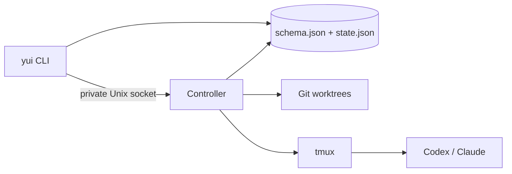

# Yui architecture

Yui is a single-user local control plane. FileTaskStore is the one authority for Yui state, tmux is the one authority for Agent terminal/process interaction, and Git is the authority for repositories and worktrees.

## Components



- The CLI owns parsing, interactive selection, setup/completion, and foreground attach.
- FileTaskStore owns all persisted domain records and atomic mutations.
- One background Controller per `YUI_HOME` owns automatic Git/tmux effects.
- tmux receives all automated input and exclusively owns interactive terminal input after attach.
- Native Agent transcript stores remain outside Yui. Only explicit messages, inputs, Run state, and summaries enter `state.json`.

The Controller socket uses a private discovery file, random token, strict JSON-line protocol, and local file permissions. It is transport, not a second persistence system.

## Persistent layout

```text
YUI_HOME/
  schema.json
  state.json
  .state.lock
  runtime/
    controller.json
    controller.sock
  worktrees/
    <task-id>/
      <role-name>/
```

`schema.json` records storage-layout version 5, aggregate-schema version 2, and a reserved `activeGeneration` pointer. `state.json` is one aggregate containing:

- configuration and completion installation records;
- configured Agents;
- Repositories;
- global Roles and their per-Agent session sets;
- Tasks, Task Roles, RoleWorkspaces, messages, WorkItems, AgentRuns, append-only events, Task Briefs, Decisions, and Milestones;
- pending Leader wakes, Leader failures, and Operator notifications.

Every persisted domain record has its own schema version and is validated when read. Unsupported aggregate or record shapes fail explicitly; Yui does not silently repair them.

Writes acquire a cross-process lock, reread the latest aggregate, apply the mutation once, and commit one replacement. The durable write path creates a mode-`0600` temporary file, flushes it, renames it over `state.json`, and flushes the containing directory. Compound workflow operations use the same transaction callback and produce one aggregate write.

The layout and aggregate migration registries are intentionally empty in this release. Their boundaries validate complete sequential plans before applying any mutation. A reserved generation pointer allows a later layout to write and validate a new immutable generation before atomically switching the manifest; generation storage is not implemented in version 5.

## Domain model and invariants

- A Task is `draft`, `active`, `completed`, or `archived`. Completion is a reversible execution fence; archive is terminal.
- Creating a Task also creates its Leader Role.
- Repository-backed active Tasks use one deterministic worktree per Role at `<YUI_HOME>/worktrees/<task-id>/<role-name>`.
- Common Role names map directly to `yui/<task-id>/<role-name>` branches; names that are not valid Git ref segments use a deterministic encoded branch segment without changing their worktree directory.
- `Task.cwd` marks the Task worktree root; each Task Role workspace agrees with its persisted RoleWorkspace path.
- A Role may bind multiple Agents but has one active Agent.
- Each `(Role, Agent)` binding has its own native session record. Switching preserves dormant sessions.
- A Role has at most one active AgentRun.
- A WorkItem has at most one active Run.
- A Worker yield atomically completes its Run/WorkItem, appends its summary, and merges a Leader wake.
- A Leader yield never creates a self-wake, but it releases any already-pending wake for the next Controller pass.
- Completing a Task requires no active Worker Run or running WorkItem, clears pending wakes and recovery failures, and rejects later execution until an explicit reopen.
- A Leader control Run may atomically yield itself while completing the Task. Reopen returns the Task to active and queues one `task-reopened` wake.
- Completed Tasks retain their Role sessions and worktrees; archived Tasks stop tmux and clean only clean worktrees.
- Archived Tasks reject new messages, Roles, work, dispatch, enter, and recovery actions.

FileTaskStore validates cross-record references after every transaction, including Repository ownership, Task/Role ownership, active-run pointers, and session-set ownership.

## Controller pass

The Controller runs a non-overlapping full reconciliation pass every 30 seconds by default. `reconciliationIntervalSeconds` may be set from 5 to 300 in Yui config. Durable state changes request an immediate pass through the Controller socket, and concurrent scan requests coalesce into one follow-up pass.

`controller restart` stops only this process and waits for its private socket/discovery state to disappear before starting the currently installed runtime. tmux sessions are external durable runtime state and are never stopped by Controller restart.

```text
prepare active workspaces
  -> stop archived Task tmux sessions
  -> clean archived workspaces when clean
  -> deliver queued Role Runs
  -> reconcile exited active Role Runs
  -> dispatch pending Leader wakes
```

Repository preparation precedes delivery. A Repository path and base ref are validated by Git. Each Role derives the path `<YUI_HOME>/worktrees/<task-id>/<role-name>` and branch `yui/<task-id>/<role-name>`. The minimal RoleWorkspace record retains its Repository, path, branch, base ref, and starting commit; it is not a ref ledger. Existing worktrees must resolve to the expected path, branch, and Git common directory.

Archive stops tmux before worktree cleanup. Each clean Role worktree is removed idempotently and recorded independently. A dirty Role worktree and its RoleWorkspace record are preserved; they are never force-removed. A Git failure is isolated to its Task so other Task reconciliation continues.

## Durable wake and Run behavior

Task activation/reopen, an Operator/user message, Worker yield, and exited Role failure can merge a `PendingWakeup`. Reasons are de-duplicated while request count and first/last timestamps remain durable. Completed Tasks never dispatch a pending wake.

If the Leader is busy, the Controller does not touch tmux and leaves the wake pending. When idle, it prepares the fixed Role session, then atomically claims the unchanged wake as a durable, not-yet-delivered Leader AgentRun before any tmux input. The claim clears that wake; later requests form a new pending wake. A confirmed receipt marks the Run delivered. A send failure fails the claim and restores its wake, while a Controller crash can resume the same Run with the same `agent-run:<run-id>` receipt.

A dispatched Worker WorkItem creates a durable AgentRun before any terminal effect. The Controller is the only automatic delivery path. Delivery uses `agent-run:<run-id>` as its receipt and persists `deliveredAt` plus successful session/Role state after tmux confirms the send. Completion and yield reject a Run whose delivery is still pending.

If an active Role's tmux window disappears before yield, the Controller fails the AgentRun and running WorkItem, clears the active-run pointer, stops its session record, and merges a failure wake for the Leader. A failed Leader recovery records `LeaderFailure` plus `OperatorNotification`; `jobs retry leader-recovery:<task-id>` clears those records and queues a recovery wake.

`jobs list` is a compatibility projection over pending wakes and recovery failures. There is no generic Job table or retry queue.

## tmux ownership and delivery

Foreground attach is a hard terminal handoff:

1. close any readline interface;
2. leave raw mode;
3. pause Yui stdin;
4. run `tmux attach-session` synchronously with inherited stdio.

Yui does not read stdin, draw UI, or relay bytes while attached.

Automatic delivery never reads stdin. It requires an adapter-specific readiness probe: Codex and Claude have separate composer markers. Before waiting for readiness, the Controller checks for an existing pane receipt, so a busy Agent does not cause a retry scan to block. Receipt check/write, literal input, and Enter execute in one tmux server command queue.

## Native session identity

Claude receives a preallocated session ID at new launch and resumes that fixed ID later.

Codex discovers its thread ID at runtime. Managed launches add a structured Codex `notify` argv configuration. After each completed turn, Codex invokes:

```text
yui internal session-notify <codex-json-payload>
```

The hidden command validates the payload and Yui provenance environment, then records the fixed task/global Role session through the Controller. No session-binding text is placed in a model prompt.

## Deliberate exclusions

This version does not restore:

- backup/restore, import/export, trash, or general maintenance commands;
- native storage extensions, derived indexes, or recovery journals;
- runtime claims, leases, fencing generations, permission fingerprints, or identity ledgers;
- inactivity TTL, cooldown, review-time, recurring schedules, or offline resolution;
- Web APIs, Web UI, or remote multi-user coordination.

Those systems are not required for the retained single-user workflow. Future storage-schema migration is the one explicit extension boundary kept in the design.
