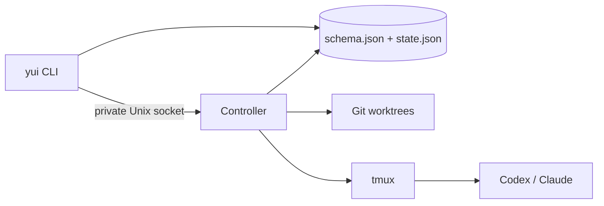

# Yui architecture

Yui is a single-user local control plane. FileTaskStore is the one authority for Yui state, tmux is the one authority for Agent terminal/process interaction, and Git is the authority for repositories and worktrees.

## Components



- The CLI owns parsing, interactive selection, setup/completion, and foreground attach.
- FileTaskStore owns all persisted domain records and atomic mutations.
- One background Controller per `YUI_HOME` owns automatic Git/tmux effects.
- tmux receives all automated input and exclusively owns interactive terminal input after attach.
- Native Agent transcript stores remain outside Yui. Only explicit messages, inputs, Run state, and summaries enter `state.json`.

The Controller socket uses a private discovery file, random token, strict JSON-line protocol, and local file permissions. It is transport, not a second persistence system.

## Domain boundaries and replaceable delivery

The implementation separates five bounded contexts:

- **Task** owns Task lifecycle, Role definitions, WorkItems, Decisions, Milestones, and workspace intent.
- **Coordination** owns the shared durable `WorkMailbox` abstraction: signals merge into `pending`, a claim freezes one `processing` batch, and signals arriving during processing form the next pending batch.
- **Execution** owns AgentRuns, Role turns, prompt envelopes, delivery acknowledgement, yield, completion, and failure.
- **Interaction** owns InputRequests, presentation, answers, recommendations, and deadlines.
- **Runtime** owns native Agent session identity, process/container bindings, availability observations, and delivery receipts.

Domain objects and application use cases must not depend on tmux commands, composer markers, Codex Hook payloads, or Controller transport. Infrastructure implements ports selected in the composition root. In particular, session hosting and message delivery are separate capabilities:

```text
SessionHost
  start / resume / stop / inspect a native Agent session

Message delivery driver
  decide when and how a pending application-level turn or presentation reaches it
```

The current scheduler composes its launch/send path from `TmuxSessionHost` and a non-blocking `TmuxPromptPushAdapter`; liveness and archive cleanup still use tmux as the physical session host. A future `hook-pull` driver can claim the same durable mailbox work without changing Task, Coordination, Execution, or Interaction state. Push and pull are deliberately not forced behind one direction-agnostic interface: they are alternative drivers of the same application use cases, such as claiming a Role turn, recording delivery, completing a turn, claiming an Operator presentation, and answering an InputRequest.

Consequently, adopting Hook delivery later should replace the delivery driver and its tmux composer probing, not the Task, Coordination, Execution, or Interaction models. tmux may remain as the session host even when delivery becomes Hook-based.

The runtime uses one dedicated tmux server per canonical `YUI_HOME`, selected through a stable Yui-specific server name. Within that server:

```text
YUI_HOME                         dedicated tmux server
  Operator                      tmux session
    operator Role               window/pane -> native Agent process/session
  Task                          tmux session
    Leader Role                 window/pane -> native Agent process/session
    Worker Role                 window/pane -> native Agent process/session
```

Thus a Task maps to one tmux session, a Role maps to one window/pane, and each pane hosts one independent native Agent process/session. tmux IDs, process IDs, AgentRun IDs, mailbox batch IDs, and native thread IDs remain distinct identities linked by Runtime bindings.

## Persistent layout

```text
YUI_HOME/
  schema.json
  state.json
  .state.lock
  runtime/
    controller.json
    controller.sock
  worktrees/
    <task-id>/
      <role-name>/
```

`schema.json` records storage-layout version 5, aggregate-schema version 3, and a reserved `activeGeneration` pointer. `state.json` is one aggregate containing:

- configuration and completion installation records;
- configured Agents;
- Repositories;
- global Roles and their per-Agent session sets;
- Tasks, Task Roles, RoleWorkspaces, messages, WorkItems, AgentRuns, append-only events, Task Briefs, Decisions, and Milestones;
- shared Task/Role/Operator WorkMailboxes, Leader failures, and Operator notifications.

Every persisted domain record has its own schema version and is validated when read. Unsupported aggregate or record shapes fail explicitly; Yui does not silently repair them.

Writes acquire a cross-process lock, reread the latest aggregate, apply the mutation once, and commit one replacement. The durable write path creates a mode-`0600` temporary file, flushes it, renames it over `state.json`, and flushes the containing directory. Compound workflow operations use the same transaction callback and produce one aggregate write.

The layout and aggregate migration registries are intentionally empty in this release. Their boundaries validate complete sequential plans before applying any mutation. A reserved generation pointer allows a later layout to write and validate a new immutable generation before atomically switching the manifest; generation storage is not implemented in version 5.

## Domain model and invariants

- A Task is `draft`, `active`, `completed`, or `archived`. Completion is a reversible execution fence; archive is terminal.
- Creating a Task also creates its Leader Role.
- Repository-backed active Tasks use one deterministic worktree per Role at `<YUI_HOME>/worktrees/<task-id>/<role-name>`.
- Common Role names map directly to `yui/<task-id>/<role-name>` branches; names that are not valid Git ref segments use a deterministic encoded branch segment without changing their worktree directory.
- `Task.cwd` marks the Task worktree root; each Task Role workspace agrees with its persisted RoleWorkspace path.
- A Role may bind multiple Agents but has one active Agent.
- Each `(Role, Agent)` binding has its own native session record. Switching preserves dormant sessions.
- A Role has at most one active AgentRun.
- A WorkItem has at most one active Run.
- A Worker yield atomically completes its Run/WorkItem, appends its summary, and merges a Leader wake.
- A Leader yield never creates a self-wake, but it releases any already-pending wake for the next Controller pass.
- Completing a Task requires no active Worker Run or running WorkItem, clears pending wakes and recovery failures, and rejects later execution until an explicit reopen.
- A Leader control Run may atomically yield itself while completing the Task. Reopen returns the Task to active and queues one `task-reopened` wake.
- Completed Tasks retain their Role sessions and worktrees; archived Tasks stop tmux and clean only clean worktrees.
- Archived Tasks reject new messages, Roles, work, dispatch, enter, and recovery actions.

FileTaskStore validates cross-record references after every transaction, including Repository ownership, Task/Role ownership, active-run pointers, and session-set ownership.

## Controller pass

The Controller runs a non-overlapping recovery reconciliation pass every 120 seconds by default. `reconciliationIntervalSeconds` may be set from 5 to 300 in Yui config. Durable state changes enqueue a canonical Task, Role, or Operator key through the Controller socket and return immediately. Keys arriving in the same fixed 100 ms window are de-duplicated into one targeted pass; a change arriving during that pass is held for the next non-overlapping batch. A Task key selects that Task and all of its Roles, a Role key selects that Role plus its Task-level Leader closure, and an Operator key uses an independent presentation lane so Task workspace work cannot delay a user question. Periodic Git/worktree and archive work is restricted to Tasks that still have durable Task-mailbox work. Active Role liveness is joined against one tmux pane inventory instead of probing every Role separately. Recommended InputRequests and pending Turn completions share one nearest-deadline selector. Explicit `task reconcile` remains an immediate recovery pass.

The socket queue is only a low-latency wake hint. Durable `WorkMailbox` records are the recovery boundary. A Task, Role, or Operator batch is atomically claimed into `processing`; signals arriving while it runs merge into the next `pending` batch. Successful orchestration completes the frozen batch. Failure releases it ahead of later pending work. Task workspace failures are isolated, so a full recovery pass completes successful Task mailboxes and releases only the failed ones.

`controller restart` stops only this process and waits for its private socket/discovery state to disappear before starting the currently installed runtime. tmux sessions are external durable runtime state and are never stopped by Controller restart.

```text
prepare active workspaces
  -> stop archived Task tmux sessions
  -> clean archived workspaces when clean
  -> deliver queued Role Runs
  -> reconcile exited active Role Runs
  -> dispatch pending Leader wakes
```

Repository preparation precedes delivery. A Repository path and base ref are validated by Git. Each Role derives the path `<YUI_HOME>/worktrees/<task-id>/<role-name>` and branch `yui/<task-id>/<role-name>`. The minimal RoleWorkspace record retains its Repository, path, branch, base ref, and starting commit; it is not a ref ledger. Existing worktrees must resolve to the expected path, branch, and Git common directory.

Archive stops tmux before worktree cleanup. Each clean Role worktree is removed idempotently and recorded independently. A dirty Role worktree and its RoleWorkspace record are preserved; they are never force-removed. A Git failure is isolated to its Task so other Task reconciliation continues.

## Durable wake and Run behavior

Task lifecycle changes, Role turns, Operator InputRequests, user messages, Worker yield, and exited Role failure enqueue the same durable `WorkMailbox` abstraction. Reasons and entity references are de-duplicated while request count, sequence range, and first/last timestamps remain durable. The old Jobs view projects pending Leader mailbox batches; it is not a separate wake store.

If the Leader is busy, or its previous native Turn has not emitted its completion Hook yet, the Controller does not touch tmux and leaves its mailbox pending. When idle, it prepares the fixed Role session, then atomically claims the pending batch, creates the durable AgentRun, and binds both the mailbox execution and persistent Turn fence before any tmux input. Later signals form a new pending batch. Yield or terminal failure closes the business Run but retains the Turn fence until the matching Hook arrives. A send failure releases the frozen batch, while a Controller crash can resume the same Run with the same `agent-run:<run-id>` receipt.

A dispatched Worker WorkItem creates a durable AgentRun and Role mailbox signal before any terminal effect. The Controller claims and binds that mailbox batch before preparing or sending externally. Delivery uses `agent-run:<run-id>` as its receipt and persists `deliveredAt` plus successful session/Role state after tmux confirms the send. Completion and yield reject a Run whose delivery is still pending and complete its bound processing batch when accepted.

If an active Role's tmux window disappears before yield, the Controller fails the AgentRun and running WorkItem, clears the active-run pointer, stops its session record, and merges a failure wake for the Leader. A failed Leader recovery records `LeaderFailure` plus `OperatorNotification`; `jobs retry leader-recovery:<task-id>` clears those records and queues a recovery wake.

`jobs list` is a compatibility projection over pending wakes and recovery failures. There is no generic Job table or retry queue.

## tmux ownership and delivery

Foreground attach is a hard terminal handoff:

1. close any readline interface;
2. leave raw mode;
3. pause Yui stdin;
4. run `tmux attach-session` synchronously with inherited stdio.

Yui does not read stdin, draw UI, or relay bytes while attached.

Automatic delivery never reads stdin. It performs one non-blocking adapter-specific readiness probe per attempt: Codex and Claude have separate composer markers. A busy launch is retried by bounded one-shot mailbox timers; subsequent availability is normally signalled by Codex turn-complete, with the 120-second pass as recovery. There is no synchronous readiness polling in the production Controller path. Receipt check/write, literal input, and Enter execute in one tmux server command queue.

## Native session identity

Claude receives a preallocated session ID at new launch and resumes that fixed ID later.

Codex discovers its thread ID at runtime. Managed launches add a structured Codex `notify` argv configuration. After each completed turn, Codex invokes:

```text
yui internal session-notify <codex-json-payload>
```

The hidden command validates the payload and Yui provenance environment, then writes the fixed session and Turn fact directly to `FileTaskStore`; it does not start or wait for the Controller. A bounded best-effort socket signal is only a wake hint. The exact Task, Role, Agent, native session, Run, receipt, and Turn identities form a persistent fence, with the last assistant summary capped before storage. If the business Run is still active, the Hook records a completion due two seconds later. A legal yield, Task completion, or InputRequest during that grace period wins; otherwise the nearest-deadline pass yields a forgotten Leader Run, completes a quiescent result-driven Task, or visibly fails a Worker Run and wakes the Leader. Duplicate and stale notifications cannot close a newer Run. No session-binding text is placed in a model prompt.

## Native Role context

`compileRoleSessionContext` is the single application boundary for stable Operator, Leader, and Worker policy. It produces developer instructions plus immutable Skill references; it does not produce a user message. The Agent adapter owns translation to a native launch channel: Codex uses additive `developer_instructions` with on-demand absolute Skill references, while Claude uses `--append-system-prompt`. Codex `skills.config` is intentionally not used as discovery because it only overrides enablement for already-discovered Skills. The runtime launch request intentionally has no initial-prompt field, making a synthetic first turn unrepresentable in the session-host port.

Dynamic orchestration remains separate: Leader wakeups and Worker Run assignments are prompt envelopes delivered from durable mailboxes after the native composer is ready. This separation lets a future hook-pull driver reuse the same Role context and mailbox use cases without depending on tmux input delivery. Unsupported adapters must fail at the adapter boundary instead of falling back to a bootstrap user message.

## Deliberate exclusions

This version does not restore:

- backup/restore, import/export, trash, or general maintenance commands;
- native storage extensions, derived indexes, or recovery journals;
- distributed leases, fencing generations, permission fingerprints, or identity ledgers;
- inactivity TTL, cooldown, review-time, recurring schedules, or offline resolution;
- Web APIs, Web UI, or remote multi-user coordination.

Those systems are not required for the retained single-user workflow. Future storage-schema migration is the one explicit extension boundary kept in the design.
