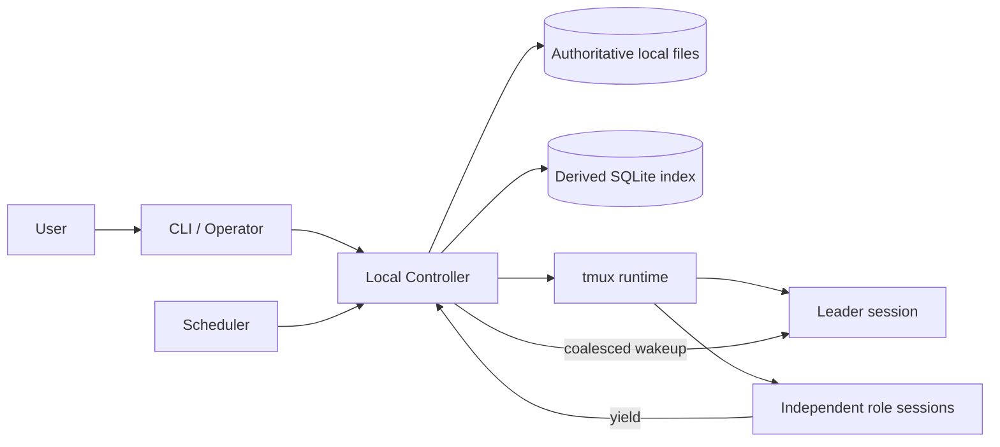
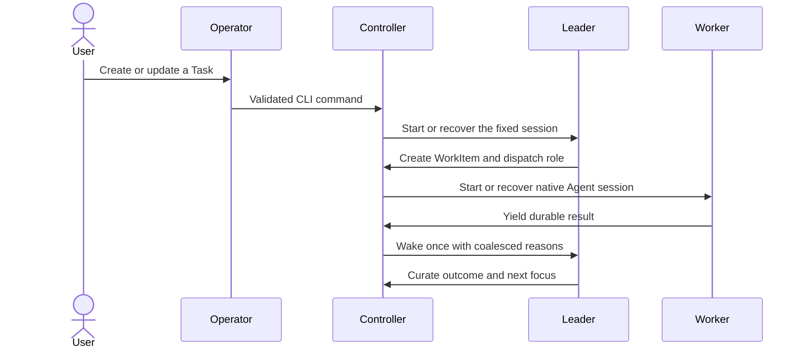

<p align="right"><strong>English</strong> | <a href="README.zh-CN.md">简体中文</a></p>

# TaskMux

TaskMux is a local control plane for long-running native agent CLI sessions. It combines a durable task model, a single local controller, and tmux-backed Agent sessions so work can continue, recover, and delegate without hiding state in a remote service.

[](https://www.npmjs.com/package/@zq-silk/taskmux)
[](LICENSE)
[](package.json)

## Why TaskMux?

- **Long-running Tasks** — keep one durable mission instead of turning every Agent round into a ticket.
- **Native Agent sessions** — run Codex, Claude, or another configured CLI in real tmux windows.
- **Clear responsibilities** — Operator administers, Leader directs, Workers execute finite WorkItems.
- **Reliable local state** — serialize mutations, recover staged transactions, and rebuild derived indexes.
- **Inspectable by default** — Task context, decisions, milestones, events, and role output remain local.

## Requirements

- Node.js 20 or newer
- tmux
- At least one native Agent CLI, such as Codex CLI or Claude Code

## Install

```sh
npm install -g @zq-silk/taskmux
taskmux setup
```

`setup` initializes `~/.taskmux`, checks tmux, and configures the default Agent and workspace. Run `taskmux` afterward to open the interactive dashboard.

## Quick start

```sh
# Create a long-running Task with its dedicated Leader.
taskmux task create "Ship the export workflow" --template feature

# Inspect current Tasks and durable context.
taskmux task board --with-roles
taskmux task context task-1 --format json

# Add user context through the controlled input flow.
taskmux task input draft task-1 "Prioritize CSV compatibility."
taskmux task input submit task-1

# Enter the fixed Leader session.
taskmux task enter task-1 leader
```

## How it works



The Controller is the single mutation boundary. It starts on demand, listens only on loopback, and coordinates persistence, scheduling, Agent dispatch, and tmux state.



## Core concepts

| Concept | Purpose |
| --- | --- |
| **Task** | A long-lived mission. It remains active until explicitly archived. |
| **Cycle** | One bounded period of Task advancement caused by input, a schedule, a role result, or inactivity. |
| **WorkItem** | A finite unit of execution with an assignee and terminal outcome. |
| **AgentRun** | One dispatched round in a native Agent session. |
| **Operator** | The persistent administrative role that translates user intent into TaskMux commands. |
| **Leader** | The fixed Task-local session that owns direction, delegation, and synthesis. |
| **Independent role** | A Worker with its own Agent session, tmux window, and optional Git worktree. |
| **Child role** | Descriptive constraints injected into a parent role; it has no TaskMux-managed runtime. |

## Core workflows

### Delegate isolated work

```sh
taskmux task assign task-1 reviewer \
  --agent codex \
  --workspace ~/projects/app

taskmux task worktree create task-1 reviewer \
  --path ../task-1-reviewer \
  --branch taskmux/task-1-reviewer

taskmux task work-item create task-1 \
  --title "Review export edge cases" \
  --assignee reviewer \
  --topic testing

taskmux task dispatch task-1 reviewer \
  --mode resume \
  --work-item work-item-1 \
  --input "Review the implementation and report blocking issues."
```

Inside the role session, finish the round with a durable result:

```sh
taskmux task yield --summary "Review complete; two edge cases need fixes."
```

### Schedule continued progress

```sh
taskmux task schedule set task-1 \
  --inactivity-minutes 60 \
  --cooldown-minutes 15 \
  --every-minutes 1440 \
  --next-at 2030-01-01T09:00:00Z
```

### Curate and archive

```sh
taskmux task milestone add task-1 \
  --title "Canary passed" \
  --summary "Export flow passed production canary checks."

taskmux task decision record task-1 \
  --title "Keep CSV as the default" \
  --rationale "It preserves compatibility for existing users."

taskmux task archive task-1 \
  --reason "Delivery complete" \
  --summary "Export workflow shipped and canary passed."
```

## Useful commands

```sh
taskmux                         # Run doctor, then open the dashboard
taskmux operator                # Enter the persistent Operator session
taskmux task board --with-roles # Inspect Tasks and role state
taskmux task context task-1     # Render durable Task context
taskmux task timeline task-1    # Read chronological Task activity
taskmux task enter task-1 leader
taskmux controller status
taskmux doctor
```

Append `--json` to ordinary commands for a stable success or error envelope. Inside a TaskMux-launched role session, scoped commands can omit Task and role IDs when the environment already identifies them.

## Local state

TaskMux stores authoritative state under `~/.taskmux` by default. Set `TASKMUX_HOME` to isolate tests or automation.

The SQLite index is derived and disposable. TaskMux refreshes derived state only at explicit Controller boundaries: startup, successful command transactions, and Scheduler scans. It does **not** watch or poll storage files. Use the CLI instead of editing TaskMux files directly when a change must take effect predictably.

See [ARCHITECTURE.md](ARCHITECTURE.md) for the system model, persistence rules, and runtime boundaries.

## Development

```sh
npm ci
make check
```

For command-by-command testing of the current checkout without touching `~/.taskmux`:

```sh
make link
taskmux-dev --help
```

`taskmux-dev` always uses `output/taskmux-cli-dev` as its isolated home and is not included in the npm package. Remove the managed launcher with `make unlink`.

## License

[MIT](LICENSE)
